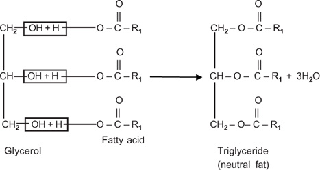

# Lipids

## General features
- Non-polar molecules
- Groups:
  - Natural fats & oils
  - Phospholipids
  - Steroids
  - Carotenoids

## Natural fats & oils
- They are aesthers[^1] of fatty acids with glycerol[^2]
[^2]:
- When glycerol reacts with a fatty acid, condensation happens to create a neutral fat
- Fatty acids have long hydrocarbon chains (Marked with `R`)
- Hydrophobic, non-polar molecules
- If a fatty acids contains a CH3 group, it is a `saturated fatty acid`
- If a fatty acids contains a CH==CH group, it is an `unsaturated fatty acid`
### Fats
- Usually solid @ room temp
- Usually contain more `saturated fatty acids`
- More stable than oils
### Oils
- Usually liquid @ room temp
- Usually contain more `unsaturated fatty acids`
- Easily become `rancid`
### Unsaturated fatty acids
- also called Vitamin F
- Essential for humans

[^1]: An aesther is a compound of `alcohol and acid`