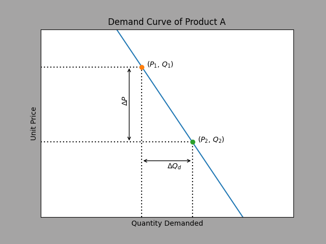

#  Demand
- Demand can be graphed by a `demand curve`
- The higher the `unit price` of a product, the lower the `quantity demanded`
- Quantity demanded =/= Demand

- Here the `line itself` is what represents demand

## Change in demand

## Determinants of demand
### Price
- Price `doesn't change the demand`, but the `quantity demanded` changes --> Movement `along the demand line`

### Non-price determinants
- Consumer preferences
- [Price of related goods](#related-goods)
- Income:
  - Normal goods: Higher income, higher consumption
  - Inferior goods: Higher income, lower consumption
- Number of consumers:
  - More consumers: Higher demand
  - Less consumers: Lower demand

  

- At the same price (P1) the Quantities demanded (QD1,QD2,QD3) are different, `based on the demand`

## Related Goods
### Substitutes
|x|Unit price|Quantity demanded|Demand|
|-----|-----|-----|-----|
|Good A|Increase|Decrease|--|
|Good B|--|Increase|Increase|\

  - If Apple is a substitute for banana:
    - Higher price in apple --> Apple gets substituted for banana --> Higher consumption of bananas (at original price level)

### Complementary goods
|x|Price|Quantity demanded|demand|
|-|-|-|-|
|Product A|Increase|Decrease|--|
|Product B|--|--|Decrease|

- Change in price of `A` --> Lower `quantity demanded of A` --> Lower `demand` for B
- Example: Tennis Ball and tennis racket