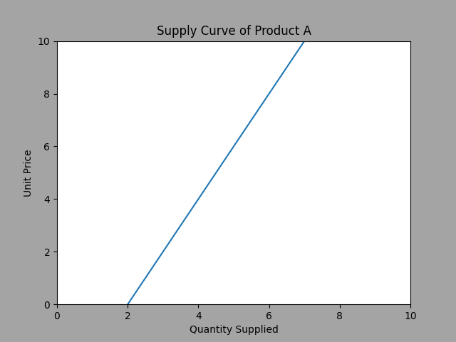
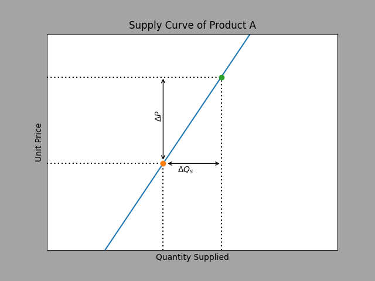
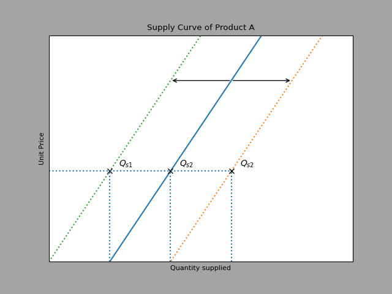

# Supply
- Law of Supply:
  - As the price of a good increases, the quantity supplied over a given time increases
  
  

## Determinants of supply
###  Price
- As price rises, the `quantity supplied` also rises
- Supply itself doesn't change

### Non-price determinants
- Production costs:
  - Higher production cost --> `Decrease` in supply
- New technology --> `Increase` in supply
- Change in number of firms --> `Increase` in supply
- Government:
    - subsidy --> `Increase` in supply
    - increasing taxes --> `Decrease` in supply
- External shock --> `Decrease` in supply
- Expectations:
  - Positive ("i expect the price to increase"):
    - Short run --> `Decrease` in supply
    - Long run --> `Increase` in supply
  - Negative ("i expect the price to fall"):
    - Short run --> `Increase`
    - Long run --> `Decrease`

### Competitive Supply
- When two goods use the same supplies

|x|Unit price|Quantity supplied|
|---|---|---|
|Product A|Increase|Increase|
|Product B|--|Decrease|

- Higher price for A:
  - Product A is more profitable
  - Higher production of A --> Lower production of B

### Joint supply
- Product B is `derived from production` of product B
- Higher quantity of A --> Higher quantity of B