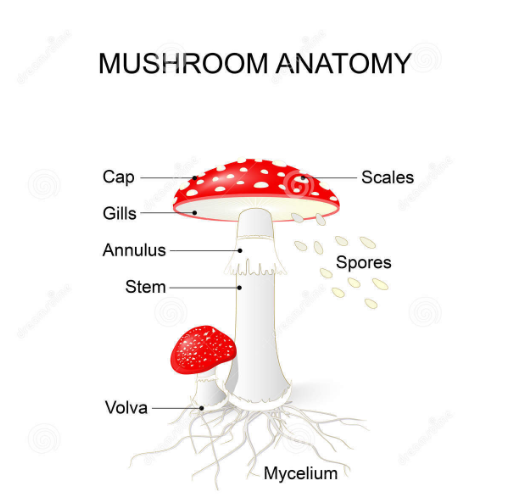

# Fungi and lichens
- Their taxonmy is under reconstruction, because of DNA comparisons

2 phyla:
1. Eumychota = valódi gombák
2. Lichens : Fungi + algae/cyanobacteria in **symbiotic relationship** (zuzmók)

## Fungi

### General characteristics
- **Heterotrophs**
- Cell wall is made of **chitin**
- Body is made of **hyphae**, this can be seen as the fruiting body\
`Hyphae are tiny filaments or threads which create a network`
- fruiting body can be edible
- non-motile [^1]
- Can be found in: air, water, soil, inside/outside living organisms

### Groupings
- Based on nutrition
    - `Saprotrophs`: besides bacteria they are the most important decomposers
    - `Parasites`:
        - **In plants**, E.g downy mildew (grape disease)
        - **In animals**, saprolegnia
        - **In humans**, athlete's foot
    - `Symbionts`:
        - Live together with mainly plants, on roots
        - Help with **water and inorganic compounds absorbtion**
        - In exchange, **fungi get organic compounds**
        - This is called `mycorrhizal symbiosis`
### Anatomy
- Cap : Kalap
- Gills : Termőréteg
- Spores : Spórák
- Annulus : Gallér
- Stem : Tönk
- Volva : Bocskor

## Lichens
- *2 organisms* living in symbiosis
    1. `Fungus`:
        - Protection
        - Water absorption
        - CO2, inorganic compounds
    2. `Algae / Cyanobacteria`:
        - Produce organic compounds in exchange for inorganic compounds
- Can live in *harsh environments*
- Can be found on tree trunks, rocks, buildings
- They help soil development
- Sensitive to air pollution, lack of lichens shows that the area is polluted (SO2)
[^1]: nem mozog

