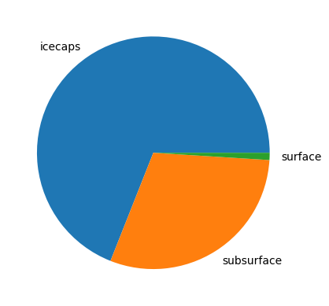

# Hydrogeography
- Most of Earth's surface water is `saline` ~ 97%
- Freshwater ~ 3%

## Freshwater
- Composition:
  - 69% --> Ice in the ice caps
  - 30% --> Groundwater
  - 1% --> Surface water
- Largest lake by water content: Lake Baykal

## Water cycle
