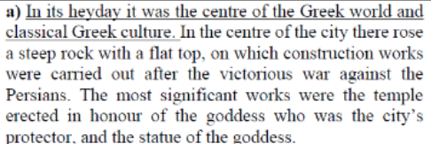
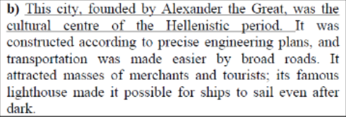
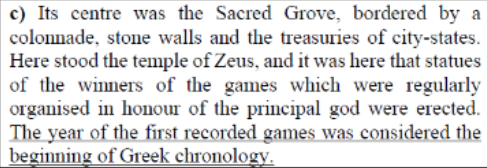

# Task

1. Feladat
 * a):  Athens $\checkmark$
 * b):  slaves $\checkmark$
 * c):  popular assembly $\checkmark$
 * d):  chosen by drawing lots $\checkmark$
 * e):  ostracism $\checkmark$
 * f):  strategoi $\checkmark$

2. Feladat\

|x|Name of ancient state| Name of cultural relics |
|-----|-----|-----|
|A|Mesopotamia/babylon|Relief of gilgames|
|B|Egypt|Hieroglyphics|
|C|Phoenician civilisation|Alphabet|

3. Feladat\

|x|x|x|
|-----|-----|-----|
|Classical period|**d**|**f**|
|Hellenistic period|**a**|**c**|

4. Feladat\

|Description| name of settlement|letter of picture|
|-----|-----|-----|
||Athens|C|
|| Alexandria|A|
||Olympia|B|

Chronological order
|1|2|3|
|-----|-----|-----|
|C|A|B|

|x|Despotic kingdom / monarchy|Aristocratic republic|Democratic republic|
|-----|-----|-----|------|
|Leaders/goverment|One leader with absolute power| A system where people have representatives, but there is an aristocratic ruling class| A system where people vote for other people to represent them in government, who then vote on issues for them|
|Making laws|Ruler decides everything|Aristocracy creates laws|Representatives create laws|
|Jurisdiction|idk king probably| ||
|Army|Army usually under direct control of ruler|Dedicated military leader|Dedicated military leader|
|Officials|Appointed by leader||In athens, chosen by lot|

